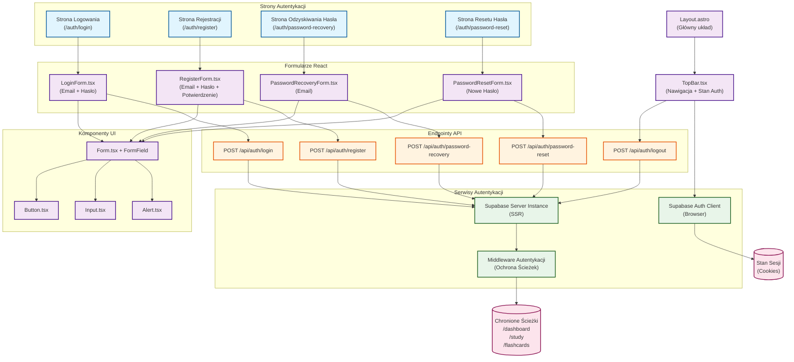

```mermaid
  flowchart TD
    %% Styles
    classDef page fill:#e1f5fe,stroke:#01579b,stroke-width:2px
    classDef component fill:#f3e5f5,stroke:#4a148c,stroke-width:2px
    classDef api fill:#fff3e0,stroke:#e65100,stroke-width:2px
    classDef service fill:#e8f5e9,stroke:#1b5e20,stroke-width:2px
    classDef store fill:#fce4ec,stroke:#880e4f,stroke-width:2px

    %% Layout & Navigation
    Layout["Layout.astro\n(Główny układ)"]:::component
    TopBar["TopBar.tsx\n(Nawigacja + Stan Auth)"]:::component
    Layout --> TopBar

    %% Auth Pages
    subgraph "Strony Autentykacji"
        Login["Strona Logowania\n(/auth/login)"]:::page
        Register["Strona Rejestracji\n(/auth/register)"]:::page
        Recovery["Strona Odzyskiwania Hasła\n(/auth/password-recovery)"]:::page
        Reset["Strona Resetu Hasła\n(/auth/password-reset)"]:::page
    end

    %% Auth Forms
    subgraph "Formularze React"
        LoginForm["LoginForm.tsx\n(Email + Hasło)"]:::component
        RegisterForm["RegisterForm.tsx\n(Email + Hasło + Potwierdzenie)"]:::component
        RecoveryForm["PasswordRecoveryForm.tsx\n(Email)"]:::component
        ResetForm["PasswordResetForm.tsx\n(Nowe Hasło)"]:::component
    end

    %% UI Components
    subgraph "Komponenty UI"
        Button["Button.tsx"]:::component
        Input["Input.tsx"]:::component
        Form["Form.tsx + FormField"]:::component
        Alert["Alert.tsx"]:::component
    end

    %% API Endpoints
    subgraph "Endpointy API"
        LoginAPI["POST /api/auth/login"]:::api
        RegisterAPI["POST /api/auth/register"]:::api
        LogoutAPI["POST /api/auth/logout"]:::api
        RecoveryAPI["POST /api/auth/password-recovery"]:::api
        ResetAPI["POST /api/auth/password-reset"]:::api
    end

    %% Auth Services
    subgraph "Serwisy Autentykacji"
        SupabaseClient["Supabase Auth Client\n(Browser)"]:::service
        SupabaseServer["Supabase Server Instance\n(SSR)"]:::service
        AuthMiddleware["Middleware Autentykacji\n(Ochrona Ścieżek)"]:::service
    end

    %% Connections - Pages to Forms
    Login --> LoginForm
    Register --> RegisterForm
    Recovery --> RecoveryForm
    Reset --> ResetForm

    %% Forms to UI Components
    LoginForm --> Form
    RegisterForm --> Form
    RecoveryForm --> Form
    ResetForm --> Form
    Form --> Button
    Form --> Input
    Form --> Alert

    %% Forms to API
    LoginForm --> LoginAPI
    RegisterForm --> RegisterAPI
    RecoveryForm --> RecoveryAPI
    ResetForm --> ResetAPI
    TopBar --> LogoutAPI

    %% API to Services
    LoginAPI --> SupabaseServer
    RegisterAPI --> SupabaseServer
    LogoutAPI --> SupabaseServer
    RecoveryAPI --> SupabaseServer
    ResetAPI --> SupabaseServer

    %% Auth Flow
    SupabaseServer --> AuthMiddleware
    AuthMiddleware --> Protected[("Chronione Ścieżki\n/dashboard\n/study\n/flashcards")]:::store

    %% Client-side Auth
    TopBar --> SupabaseClient
    SupabaseClient --> SessionStore[("Stan Sesji\n(Cookies)")]:::store
```
